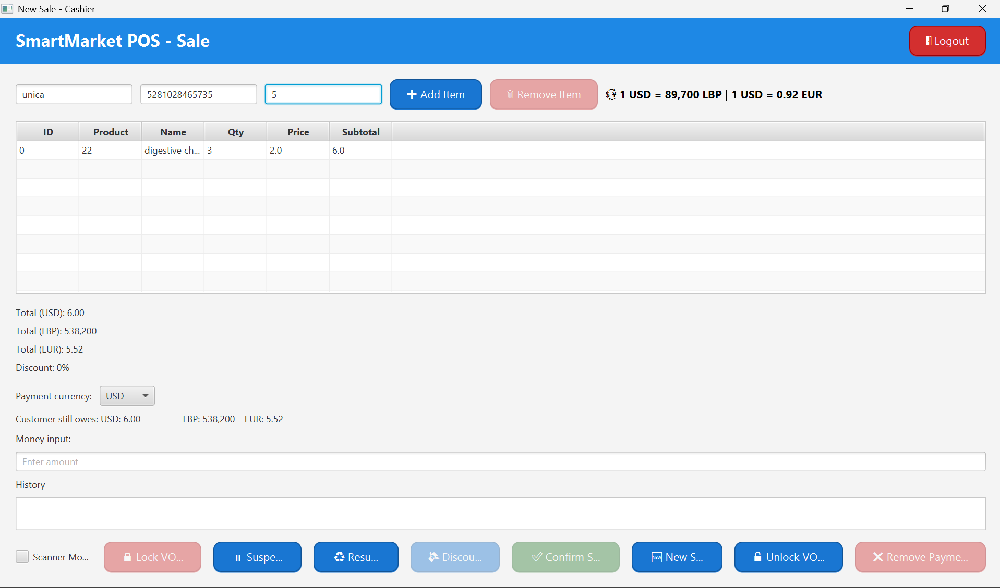
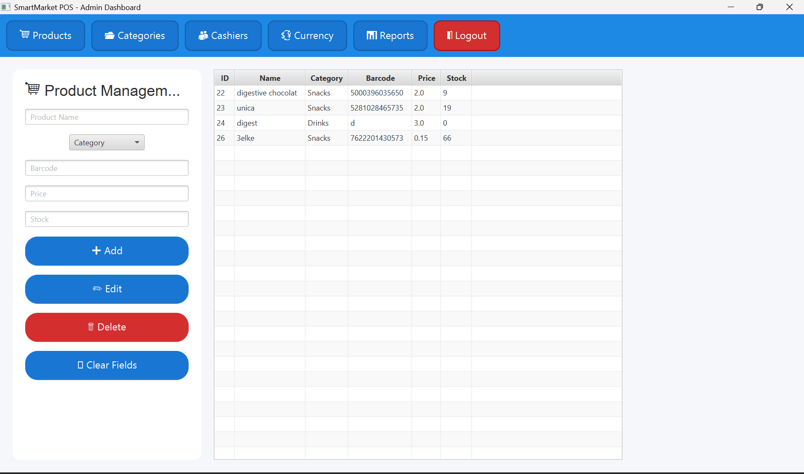
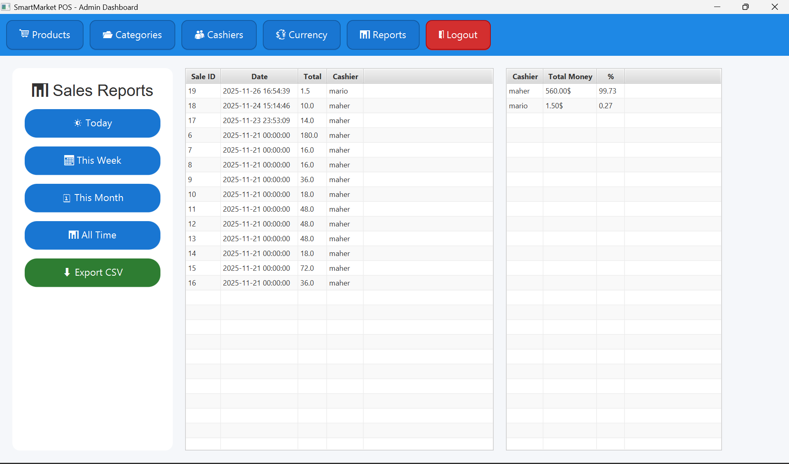
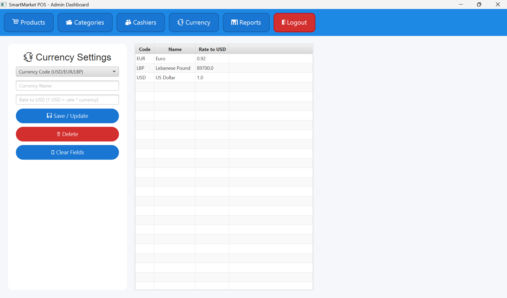
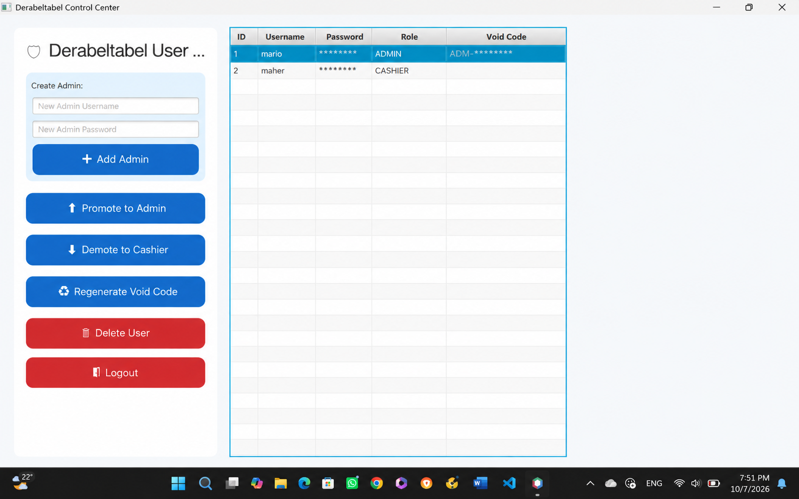

# SmartMarket POS

SmartMarket POS is a Java-based Point of Sale application designed for managing supermarket operations.

The system provides role-based access for administrators and cashiers, allowing users to manage products, categories, cashiers, currencies, sales, and reports.

## Technologies Used

- Java
- JavaFX
- MySQL
- JDBC
- Maven
- Git & GitHub

## Features

### Admin
- Product management: add, edit, and delete products
- Category management
- Cashier account management
- Multi-currency configuration for USD, LBP, and EUR
- Sales reporting by day, week, month, or all time
- Cashier sales performance tracking
- Export sales reports to CSV

### Cashier
- Create and process sales
- Search products by name or barcode
- Barcode scanner support
- Add and remove items from a sale
- Automatic subtotal and total calculations
- Display totals in USD, LBP, and EUR
- Select payment currency
- Apply discounts
- Suspend and resume sales
- Track payments and remaining amounts
- Restricted cashier actions protected through void-card authorization
- Void-card scanning to unlock authorized operations

### User & Role Management
- Create administrator accounts
- Promote cashiers to administrators
- Demote administrators to cashiers
- Delete user accounts
- Generate and regenerate void authorization codes

## Screenshots

### Cashier / Point of Sale

### Product Management

### Sales Reports

### Currency Settings

### User & Role Management

## Project Structure

The application follows a layered structure to separate the user interface, business logic, data models, and database operations.

- **Controllers** – Handle interactions between the views and application logic
- **Models** – Represent entities such as products, users, sales, categories, and currencies
- **Services** – Handle business logic and database operations
- **Views** – JavaFX user interfaces
- **Util** – Database connection and supporting utilities
- **Resources** – Application resources such as the scanner sound

## Database

SmartMarket POS uses MySQL for persistent data storage. The database stores information related to:

- Users and roles
- Products and categories
- Sales and sale items
- Currency configuration

A database diagram is included in the repository as `Diagram - quizdb.jpg`.

## Running the Project

### Requirements

- Java JDK
- JavaFX
- Maven
- MySQL Server
- Apache NetBeans or another Java IDE with JavaFX support

### Setup

1. Clone the repository.
2. Create the required MySQL database and tables based on the included database diagram.
3. Configure the database connection in the application with your own MySQL credentials.
4. Open the project as a Maven project.
5. Build and run `SmartMarketPOS.java`.

> Database credentials are not included in the repository and must be configured locally.

## About

SmartMarket POS was developed as an Object-Oriented Programming project to apply Java, JavaFX, MySQL, JDBC, MVC-style separation, and object-oriented programming concepts in a practical desktop application.